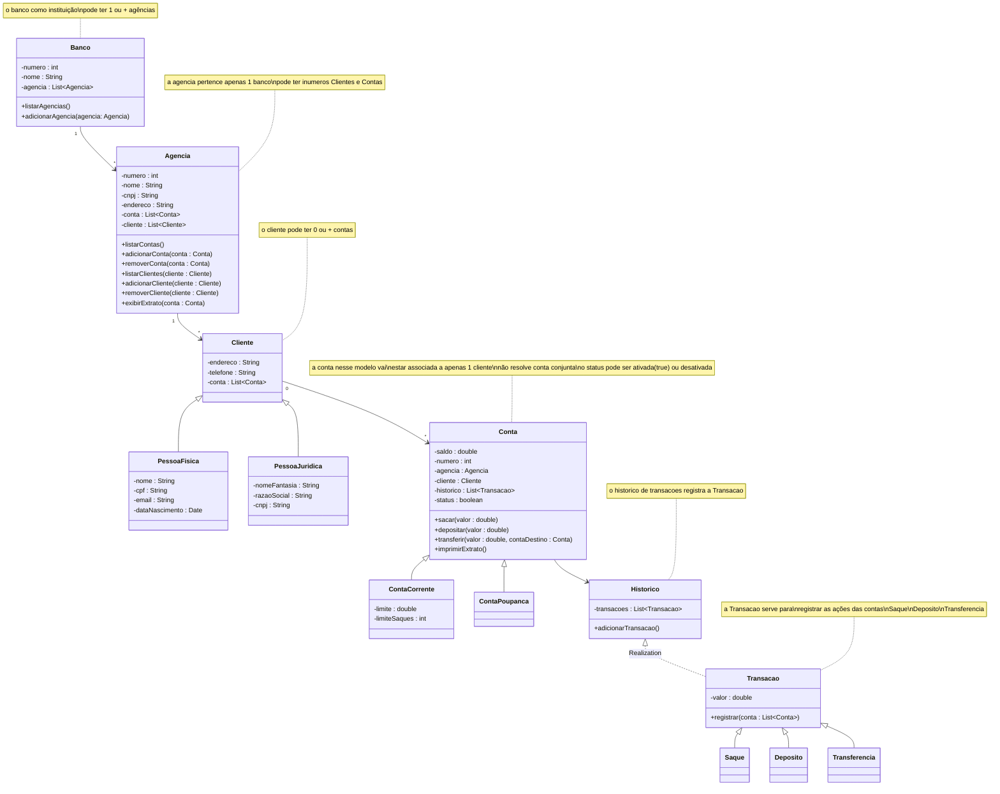

# Criando um Banco Digital com Java e Orientação a Objetos

Desafio do Laboratorio para aprender POO em JAVA do curso da DIO

## Proposta

Desafio: Considerando nosso conhecimento no domínio bancário, iremos abstrair uma solução Orientada a Objetos em Java. Para isso, vamos interpretar o seguinte cenário:
“Um banco oferece aos seus clientes dois tipos de contas (corrente e poupança), as quais possuem as funcionalidades de depósito, saque e transferência (entre contas da própria instituição).”

## Analise da proposta

No caso acima destacamos ali Clientes, Banco, Conta, sabido que na organização bancaria temos as Agências e como funcionalidades temos depositos, saque, transferência entres contas.

### Classes e Funcionalidades a Modelar

Pensando no cenário proposto e de melhorias baseado na live e material de apoio, monto o cenário e modelo que segue, não considerando fechamento de agências, ou de bancos... caminho das flores:

1. **Banco**
   - Atributos: `numero`, `nome`, `agencia[]`
   - Métodos: `listarAgencias`, `adicionarAgencia`
2. **Agencia**
   - Atributos: `numero`, `nome`, `cnpj`, `endereco`, `conta[]`, `cliente[]`
   - Métodos: `listarContas`, `adicionarConta`, `removerConta`, `listarClientes`, `adicionarCliente`, `removerCliente`, `exibirExtrato`
3. **Cliente**
   - Atributos: `endereco`, `conta[]`, `telefone`
   - Métodos: `realizarTransacao`, `adicionarConta`, `removerConta`
4. **PessoaFisica**
   - Atributos: `nome`, `cpf`, `email`, `dataNascimento`
5. **PessoaJuridica**
   - Atributos: `nomeFantasia`, `razaoSocial`, `cnpj`
6. **Conta**
   - Atributos: `saldo`, `numero`, `agencia`, `cliente`, `historico`, `status`
   - Métodos: `sacar`, `depositar`, `transferir`, `imprimirExtrato`
7. **Historico**
   - Atributos: `transacoes`
   - Métodos: `adicionarTransacao`
8. **ContaCorrente**
   - Atributos: `limite`, `limiteSaques`
9. **ContaPoupanca**
   - Atributos: `herdados_apenas`
10. **Transacao**
    - Atributos: `valor`
    - Métodos: `registrar`
11. **Saque**
    - Atributos: `herdados_apenas`
    - Métodos: `herdados_apenas`
12. **Deposito**
    - Atributos: `herdados_apenas`
    - Métodos: `herdados_apenas`
13. **Transferencia**
    - Atributos: `herdados_apenas`
    - Métodos: `herdados_apenas`

### Diagrama UML Desenvovido com Mermaid

## Considerações

A realização da modelagem e melhorias foi realizada antes de qualquer codificação, pode ser que exista alguma necessidade de melhoria no processo de desenvolvimento, ainda assim, desenhar a solução e imaginar o produto, fazer o discovery da necessidade é fundamental com todos os envolvidos.
Como o Desafio é melhorar a proposta, então novos elementos foram colocados para gestão das contas e transações nesse caso de uso.
Não tenho conhecimento de como é o funcionamento desses controles, apenas imaginei uma solução e qualquer semelhança com a realidade ou com outro projeto bancario dado o objetivo do desafio é mera coincidência.

## Conclusão

Essa implantação já tras melhorias para o desafio proposto, o Main está com algumas iterações e durante o processo de criar os objetos surgiram ideias para melhorias como:

  1. Validações em campo aberto: para os casos temos que criar mecanismos de validações para não permitir injeções que possam comprometer a segurança da aplicação
  2. Organizar as responsabilidades: Colocar regras de negocio em um diretorio, colocar modelos em outro e disponibilizar serviços, sempre é vom deixar cada qual em seu respectivo local para mitigar o uso indevido de classes de negocio
  3. Ferramentas basicas: Uma classe "Utils" com validações conhecidas de CPF, CNPJ, mascaras para apresentar tais valores de forma a melhorar a experiência do usuario como no Extrato padronizado com formatação dos campos de valores... etc.
  4. App Bancario: Seguindo a linha do desafio do Iphone, é possivel imaginar um app genérico com menus classicos onde o usuario fazendo uso de seu "cartão" possa realizar as operações de suas contas.

O primeiro passo está dado, fiquem a vontade para sugestões de melhorias e favoritar ao realizar um fork do projeto!
